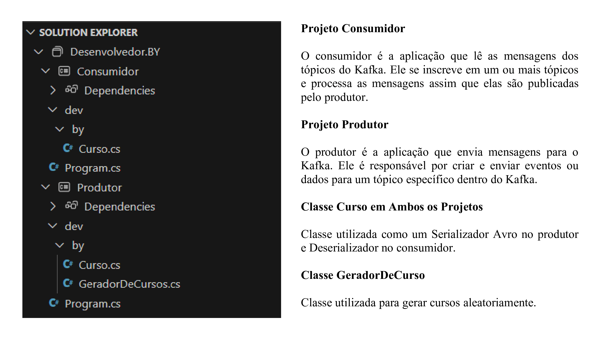

# Kafka

Boas práticas na escrita de software que você pode aplicar para obter uma maior legibilidade e manutenabilidade do seu código.

## 🛠️ Construído com 

* [Visual Studio 2022](https://learn.microsoft.com/pt-br/visualstudio/windows/?view=vs-2022) - Ferramenta de desenvolvimento, que permite realizar todo o ciclo de desenvolvimento em um só lugar.

## 📚 Principais Bibliotecas, Frameworks e Comandos do NuGet Utilizados

* [net9.0](https://learn.microsoft.com/pt-br/dotnet/core/whats-new/dotnet-9/overview) - Versão da plataforma de desenvolvimento .NET, que é de código aberto e multiplataforma, desenvolvida pela Microsoft.
```
dotnet add package Microsoft.NET.Sdk.Web --version 8.0.0
```
* [Confluent.Kafka]() -  Biblioteca cliente para a plataforma Apache Kafka para fornecer uma interface de alta performance e fácil de usar para interagir com o Kafka a partir de aplicações .NET (C#).
```
dotnet add package Confluent.Kafka
```
* [Confluent.SchemaRegistry.Serdes.Avro]() - Biblioteca do Confluent, parte da plataforma Apache Kafka, que oferece suporte ao uso de schemas Avro (um formato de serialização de dados) para codificar e decodificar mensagens em um sistema Kafka.
```
dotnet add package Confluent.SchemaRegistry.Serdes.Avro
```
## 🚧 Descrição da Estrutura do Projeto

A estrutura do projeto segundo a imagem abaixo é composta da seguinte forma:



## ⚠️ Atenção

Destinado exclusivamente para fins de estudo.

---
⌨️ por [Byron Doria](https://gist.github.com/lohhans) 😊
