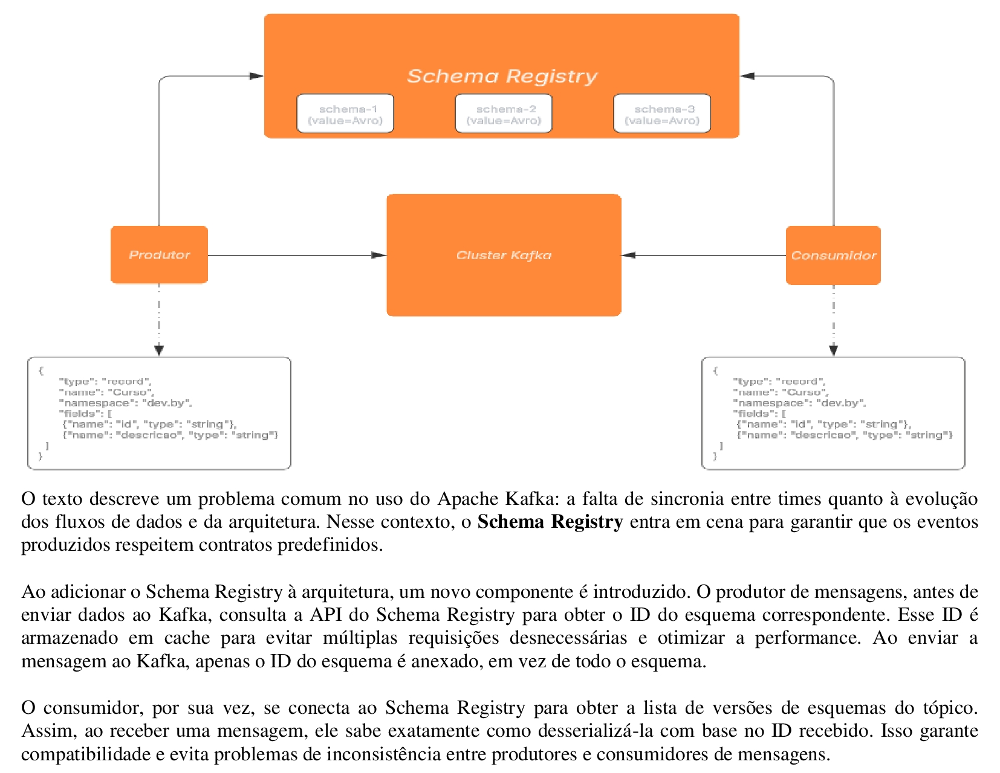

# Kafka

<p align="justify"> 
Criação de uma solution com dois projetos, com objetivo ensinar a aplicação prática de um produtor(responsável por produzir as mesagens para o Apache Kafka) e o consumidor(responsável por consumir as mensagens que chegam em um determinado tópico).
</p> 

## 🛠️ Construído com 

* [Visual Studio Code](https://code.visualstudio.com/) - Editor de código-fonte leve e de código aberto da Microsoft, que oferece uma experiência de desenvolvimento poderosa e altamente personalizável, embora seja mais simples que o Visual Studio.

## 📚 Principais Bibliotecas, Frameworks e Comandos do NuGet Utilizados

* [net9.0](https://learn.microsoft.com/pt-br/dotnet/core/whats-new/dotnet-9/overview) - Versão da plataforma de desenvolvimento .NET, que é de código aberto e multiplataforma, desenvolvida pela Microsoft.

```
dotnet add package Microsoft.NET.Sdk.WebAssembly.Pack --version 9.0.0
```

* [Confluent.Kafka]() -  Biblioteca cliente para a plataforma Apache Kafka para fornecer uma interface de alta performance e fácil de usar para interagir com o Kafka a partir de aplicações .NET (C#).

```
dotnet add package Confluent.Kafka
```

* [Confluent.SchemaRegistry.Serdes.Avro]() - Biblioteca do Confluent, parte da plataforma Apache Kafka, que oferece suporte ao uso de schemas Avro (um formato de serialização de dados) para codificar e decodificar mensagens em um sistema Kafka.

```
dotnet add package Confluent.SchemaRegistry.Serdes.Avro
```

## 📚 Principais Comandos Via CLI

* Inicia e Executa containers Docker

```
PS C:\ClusterKafka> docker-compose -f docker-compose-confluent.yml up -d
```

* Criando um tópico

```
E:\ClusterKafka\Kafka> .\bin\windows\kafka-topics.bat --create --topic cursos --bootstrap-server localhost:9094
```

* Listando tópicos

```
E:\ClusterKafka\Kafka> .\bin\windows\kafka-topics.bat --list --bootstrap-server localhost:9094
E:\ClusterKafka\Kafka> .\bin\windows\kafka-topics.bat --list --bootstrap-server localhost:9095
E:\ClusterKafka\Kafka> .\bin\windows\kafka-topics.bat --list --bootstrap-server localhost:9094, localhost:9095
```

* Excluíndo um tópico

```
E:\ClusterKafka\Kafka> .\bin\windows\kafka-topics.bat --delete --topic cursos --bootstrap-server localhost:9094
```

* Criando um tópico com partição e fator de replicação

```
E:\ClusterKafka\Kafka> .\bin\windows\kafka-topics.bat --create --topic cursos --bootstrap-server localhost:9094 --partitions 2 --replication-factor 2
```

* Alterando a quantidade de partições

```
E:\ClusterKafka\Kafka> .\bin\windows\kafka-topics.bat --alter --topic cursos --bootstrap-server localhost:9094 --partitions 3
```

* Obter informações de um tópico

```
E:\ClusterKafka\Kafka> .\bin\windows\kafka-topics.bat --describe --topic cursos --bootstrap-server localhost:9094
```

* Produzindo mensagens

```
E:\ClusterKafka\Kafka> .\bin\windows\kafka-console-producer.bat --topic cursos --bootstrap-server localhost:9094
```

* Consumindo mensagens

```
E:\ClusterKafka\Kafka> .\bin\windows\kafka-console-consumer.bat --topic cursos --bootstrap-server localhost:9094 
```

* Consumindo mensagens em um grupo de consumidores

```
E:\ClusterKafka\Kafka> .\bin\windows\kafka-console-consumer.bat --topic cursos --bootstrap-server localhost:9094
```

## 🚧 Descrição das Classes: Produtor e Consumidor

* Produtor

```
// Importa a biblioteca do Confluent Kafka, necessária para comunicação com Kafka.
using Confluent.Kafka;
// Importa a biblioteca do Schema Registry do Confluent, que é usada para validar esquemas Avro.
using Confluent.SchemaRegistry;
// Importa a biblioteca de Serializadores do Schema Registry, que lida com a serialização e desserialização dos dados.
using Confluent.SchemaRegistry.Serdes;
// Importa o namespace onde o tipo "Curso" está localizado (provavelmente o seu modelo de dados).
using Produtor.dev.by;

// Configuração do Schema Registry, incluindo a URL do servidor de registros e as credenciais de autenticação.
var schemaConfig = new SchemaRegistryConfig
{
  // URL do servidor Schema Registry
  Url = "http://localhost:8081",BasicAuthUserInfo=""
};

// Cria um cliente para acessar o Schema Registry e armazenar o esquema em cache.
var SchemaRegistry = new CachedSchemaRegistryClient(schemaConfig);

// Configuração do produtor Kafka, especificando o servidor de bootstrap (Kafka).
var config = new ProducerConfig{ BootstrapServers = "localhost:9092" };

// Cria uma instância de produtor Kafka, com chave do tipo string e valor do tipo "Curso" serializado em Avro.
using var producer = new ProducerBuilder<string, dev.by.Curso>(config)
// Define o serializador Avro para o valor
.SetValueSerializer(new AvroSerializer<dev.by.Curso>(SchemaRegistry))
// Constrói o produtor
.Build();

// Cria um objeto para gerar cursos aleatórios.
 GeradorDeCursos gerador = new GeradorDeCursos(); 
 // Gera um nome de curso aleatório usando o gerador.
 string NomeCursoAleatorio = gerador.GerarNomeCurso();

// Cria uma mensagem Kafka com uma chave do tipo string e valor do tipo "Curso".
var message = new Message<string, dev.by.Curso>
{
  // Gera uma chave única (UUID) para a mensagem
    Key = Guid.NewGuid().ToString(),
    // Cria o objeto "Curso" com valores preenchidos
    Value = new dev.by.Curso
    {
      // Gera um ID único para o curso
        id = Guid.NewGuid().ToString(),
        // Atribui a descrição gerada aleatoriamente ao curso
        descricao = NomeCursoAleatorio
    }
};

// Envia a mensagem para o tópico "cursos" e aguarda o resultado da produção assíncrona.
var result = await producer.ProduceAsync("cursos", message);

// Exibe o tópico, partição e offset onde a mensagem foi produzida.
Console.WriteLine($"Tópico: {result.Topic}, Partição {result.Partition} e Offset {result.Offset}");
```

* Consumidor

```
// Importa a biblioteca do Confluent Kafka, necessária para comunicação com Kafka.
using Confluent.Kafka;
// Importa a biblioteca SyncOverAsync, que permite usar métodos assíncronos de maneira síncrona, útil para deserialização.
using Confluent.Kafka.SyncOverAsync;
// Importa a biblioteca do Schema Registry do Confluent, usada para validar esquemas Avro.
using Confluent.SchemaRegistry;
// Importa a biblioteca de Serializadores e Deserializadores do Schema Registry, que lida com a serialização e desserialização dos dados.
using Confluent.SchemaRegistry.Serdes;

// Configuração do Schema Registry, incluindo a URL do servidor de registros.
var schemaConfig = new SchemaRegistryConfig
{
  // Define a URL do servidor do Schema Registry
  Url = "http://localhost:8081"
};

// Cria um cliente para acessar o Schema Registry e armazenar o esquema em cache.
var SchemaRegistry = new CachedSchemaRegistryClient(schemaConfig);

// Configuração do consumidor Kafka, especificando o grupo de consumidores e o servidor de bootstrap (Kafka).
var config = new ConsumerConfig
{
  // Define o ID do grupo de consumidores, que permite o balanceamento de carga entre consumidores.
    GroupId = "devby",
    // Define o servidor de bootstrap Kafka.
    BootstrapServers = "localhost:9092"
};

// Cria uma instância de consumidor Kafka, com chave do tipo string e valor do tipo "Curso" deserializado em Avro.
using var consumer = new ConsumerBuilder<string, dev.by.Curso>(config)
// Define o desserializador Avro para o valor e usa o SyncOverAsync para operações síncronas.
.SetValueDeserializer(new AvroDeserializer<dev.by.Curso>(SchemaRegistry).AsSyncOverAsync()) 
// Constrói o consumidor
.Build();

// Inscreve o consumidor no tópico "cursos" para receber mensagens.
consumer.Subscribe("cursos");

// Loop infinito para consumir as mensagens continuamente.
while (true)
{
    // Consome a próxima mensagem do tópico "cursos" e aguarda a chegada de uma mensagem.
    var result = consumer.Consume();
    // Exibe o conteúdo da descrição da mensagem recebida.
    Console.WriteLine($"Mensagem: {result.Message.Value.descricao}");
}
```

## 🚧 Descrição da Estrutura do Cluster do Kafka

A estrutura do cluster do kafka segundo a imagem abaixo é composta da seguinte forma:



## 🚧 Descrição da Estrutura do Projeto

A estrutura do projeto segundo a imagem abaixo é composta da seguinte forma:


## ⚠️ Atenção 

Destinado exclusivamente para fins de estudo.

---
⌨️ por [Byron Doria](https://gist.github.com/lohhans) 😊
