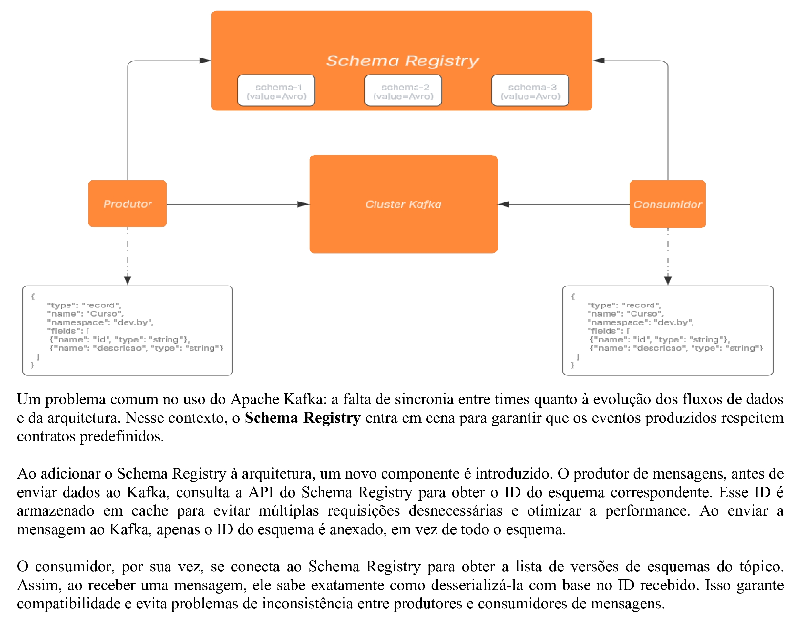

# Kafka

<p align="justify"> 
Criação de uma solution com dois projetos, com objetivo ensinar a aplicação prática de um produtor(responsável por produzir as mesagens para o Apache Kafka) e o consumidor(responsável por consumir as mensagens que chegam em um determinado tópico).
</p> 

## 🛠️ Construído com 

* [Visual Studio Code](https://code.visualstudio.com/) - Editor de código-fonte leve e de código aberto da Microsoft, que oferece uma experiência de desenvolvimento poderosa e altamente personalizável, embora seja mais simples que o Visual Studio.

## 📚 Principais Bibliotecas, Frameworks e Comandos do NuGet Utilizados

* [net9.0](https://learn.microsoft.com/pt-br/dotnet/core/whats-new/dotnet-9/overview) - Versão da plataforma de desenvolvimento .NET, que é de código aberto e multiplataforma, desenvolvida pela Microsoft.

```
dotnet add package Microsoft.NET.Sdk.WebAssembly.Pack --version 9.0.0
```

* [Confluent.Kafka]() -  Biblioteca cliente para a plataforma Apache Kafka para fornecer uma interface de alta performance e fácil de usar para interagir com o Kafka a partir de aplicações .NET (C#).

```
dotnet add package Confluent.Kafka
```

* [Confluent.SchemaRegistry.Serdes.Avro]() - Biblioteca do Confluent, parte da plataforma Apache Kafka, que oferece suporte ao uso de schemas Avro (um formato de serialização de dados) para codificar e decodificar mensagens em um sistema Kafka.

```
dotnet add package Confluent.SchemaRegistry.Serdes.Avro
```

## 📚 Principais Comandos Via CLI

* Inicia e Executa containers Docker

```
PS C:\ClusterKafka> docker-compose -f docker-compose-confluent.yml up -d
```

* Criando um tópico

```
E:\ClusterKafka\Kafka> .\bin\windows\kafka-topics.bat --create --topic cursos --bootstrap-server localhost:9094
```

* Listando tópicos

```
E:\ClusterKafka\Kafka> .\bin\windows\kafka-topics.bat --list --bootstrap-server localhost:9094
E:\ClusterKafka\Kafka> .\bin\windows\kafka-topics.bat --list --bootstrap-server localhost:9095
E:\ClusterKafka\Kafka> .\bin\windows\kafka-topics.bat --list --bootstrap-server localhost:9094, localhost:9095
```

* Excluíndo um tópico

```
E:\ClusterKafka\Kafka> .\bin\windows\kafka-topics.bat --delete --topic cursos --bootstrap-server localhost:9094
```

* Criando um tópico com partição e fator de replicação

```
E:\ClusterKafka\Kafka> .\bin\windows\kafka-topics.bat --create --topic cursos --bootstrap-server localhost:9094 --partitions 2 --replication-factor 2
```

* Alterando a quantidade de partições

```
E:\ClusterKafka\Kafka> .\bin\windows\kafka-topics.bat --alter --topic cursos --bootstrap-server localhost:9094 --partitions 3
```

* Obter informações de um tópico

```
E:\ClusterKafka\Kafka> .\bin\windows\kafka-topics.bat --describe --topic cursos --bootstrap-server localhost:9094
```

* Produzindo mensagens

```
E:\ClusterKafka\Kafka> .\bin\windows\kafka-console-producer.bat --topic cursos --bootstrap-server localhost:9094
```

* Consumindo mensagens

```
E:\ClusterKafka\Kafka> .\bin\windows\kafka-console-consumer.bat --topic cursos --bootstrap-server localhost:9094 
```

* Consumindo mensagens em um grupo de consumidores

```
E:\ClusterKafka\Kafka> .\bin\windows\kafka-console-consumer.bat --topic cursos --bootstrap-server localhost:9094
```

## 🚧 Descrição das Classes: Produtor e Consumidor

* Produtor

```
PS C:\ClusterKafka> docker-compose -f docker-compose-confluent.yml up -d
```

* Consumidor

```
PS C:\ClusterKafka> docker-compose -f docker-compose-confluent.yml up -d
```

## 🚧 Descrição da Estrutura do Cluster do Kafka

A estrutura do cluster do kafka segundo a imagem abaixo é composta da seguinte forma:



## 🚧 Descrição da Estrutura do Projeto

A estrutura do projeto segundo a imagem abaixo é composta da seguinte forma:


## ⚠️ Atenção 

Destinado exclusivamente para fins de estudo.

---
⌨️ por [Byron Doria](https://gist.github.com/lohhans) 😊
